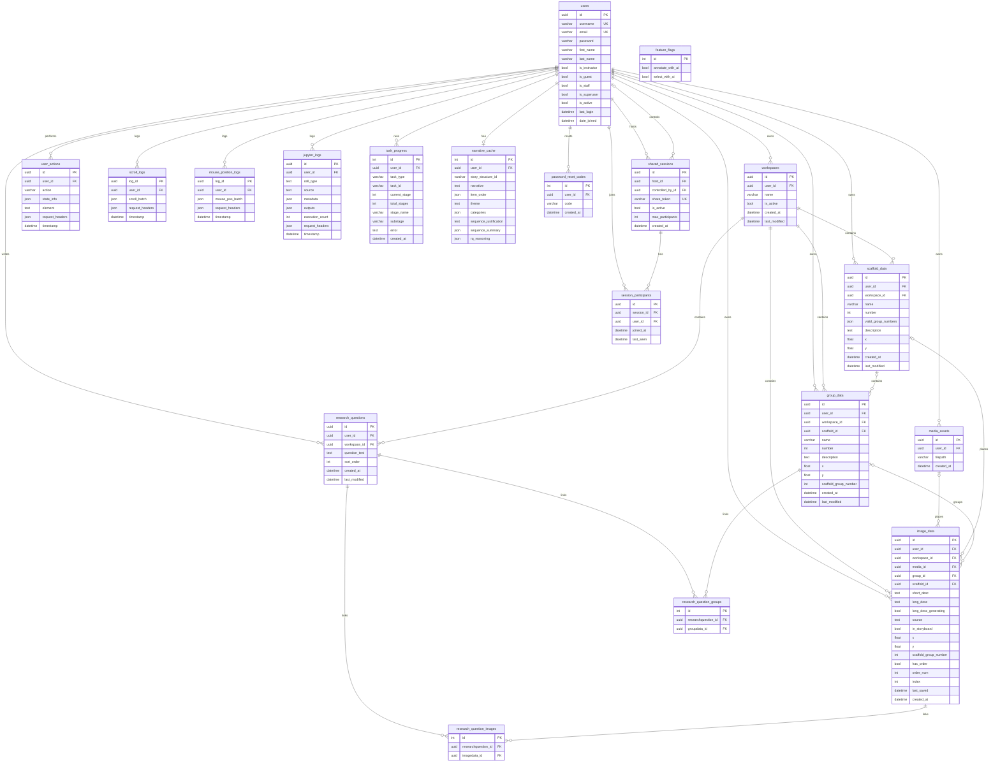

# CAST backend ERD

Open this file in **Visual Studio Code** (update to the latest version) and use **Markdown Preview** (`Ctrl+Shift+V` / `Cmd+Shift+V`). Do not use Cursor’s preview: VS Code natively renders Mermaid and ERD syntax.

**Cardinality:** `||` one · `o|` zero-or-one · `}|` one-or-more · `o{` zero-or-more

## Notes

- Table names match Django `db_table`. `users` is the custom `AUTH_USER_MODEL` (`users.User`).
- **Workspaces (max 3 per user):** `workspaces` is a named canvas snapshot. A user may keep up to **3** rows (`MAX_WORKSPACES_PER_USER` in `workspace_ops.py`; enforced in app logic, not a DB check). Exactly **one** workspace per user may have `is_active=True` (`one_active_workspace_per_user` unique constraint). Canvas work (`scaffold_data`, `group_data`, `image_data`, `research_questions`) is scoped to a workspace and **CASCADE**s when that workspace is deleted. At the cap, creating a new named workspace reuses a chosen existing row (clears its canvas, then activates it) rather than inserting a fourth.
- **Shared media:** `media_assets` is the on-disk image identity (`uniq_user_media_filepath` on `(user, filepath)`). `image_data` is a placement in a workspace; notes have `media_id` NULL. File bytes are not copied per workspace. A placement is unique per `(workspace, media)` when `media` is set (`uniq_workspace_media_placement`). `image_data.media_id` is **RESTRICT** so a file is not dropped while any placement still references it; unreferenced assets are purged in app code.
- Delete rules: most FKs to `users` and canvas FKs to `workspaces` are **CASCADE**. `group_data.scaffold_id`, `image_data.group_id`, `image_data.scaffold_id`, and `shared_sessions.controlled_by` are **SET NULL**. `image_data.media_id` is **RESTRICT**.
- `session_participants` is unique on `(session, user)`.
- `research_question_images` and `research_question_groups` are Django auto M2M tables (`api_researchquestion_images` / `api_researchquestion_groups` in the database).
- `feature_flags` is a standalone singleton-style row with no relations. `narrative_cache` and telemetry tables remain per-user (not per-workspace).
- A few column names in the diagram are aliased so Mermaid will parse (`question_text` = `text`, `sort_order` / `item_order` = `order`).
- `User` also inherits Django auth M2M tables (`users_groups`, `users_user_permissions`); those are omitted here.
